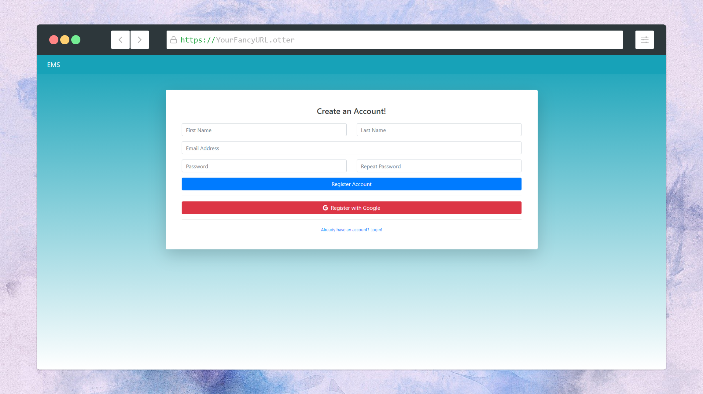
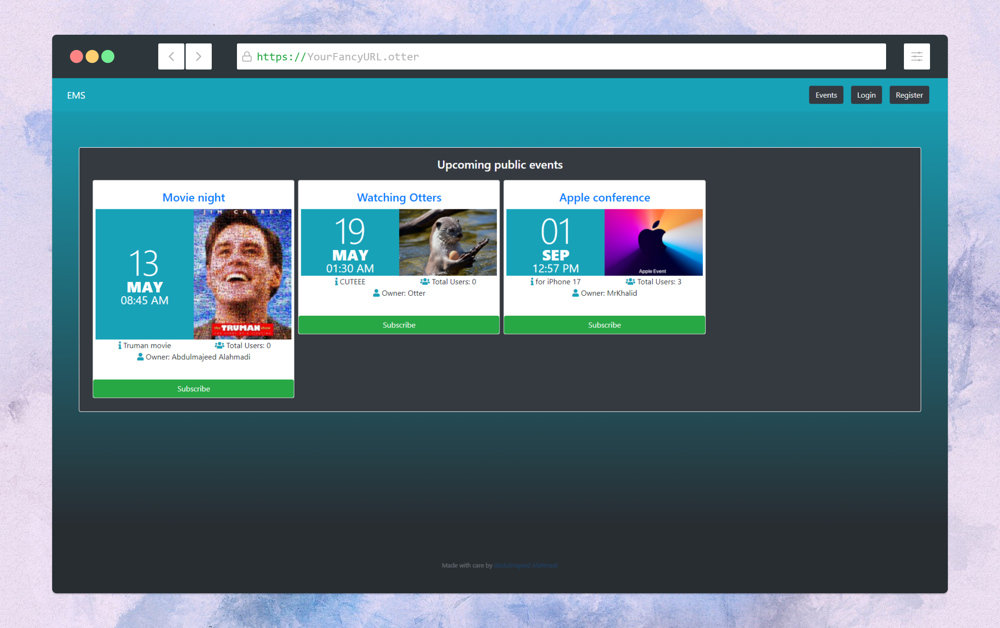
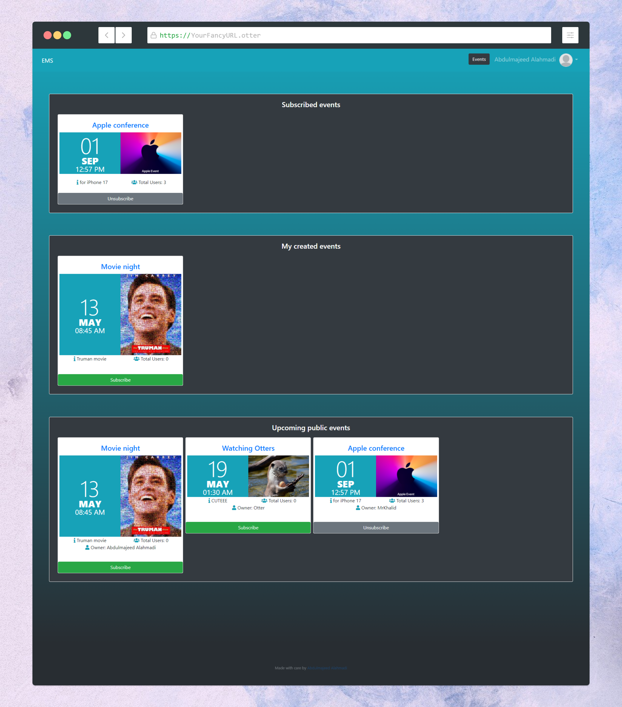
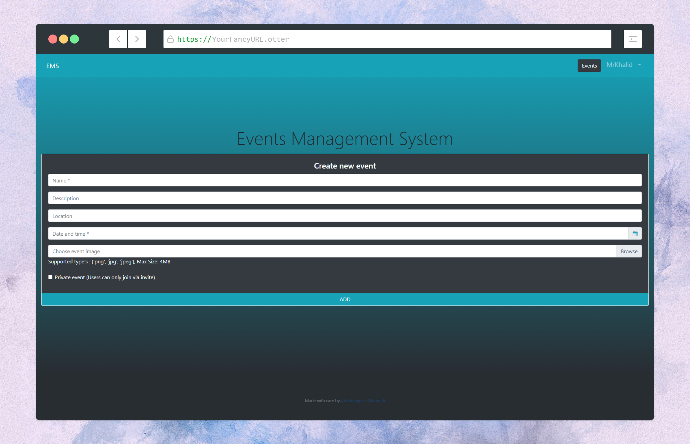
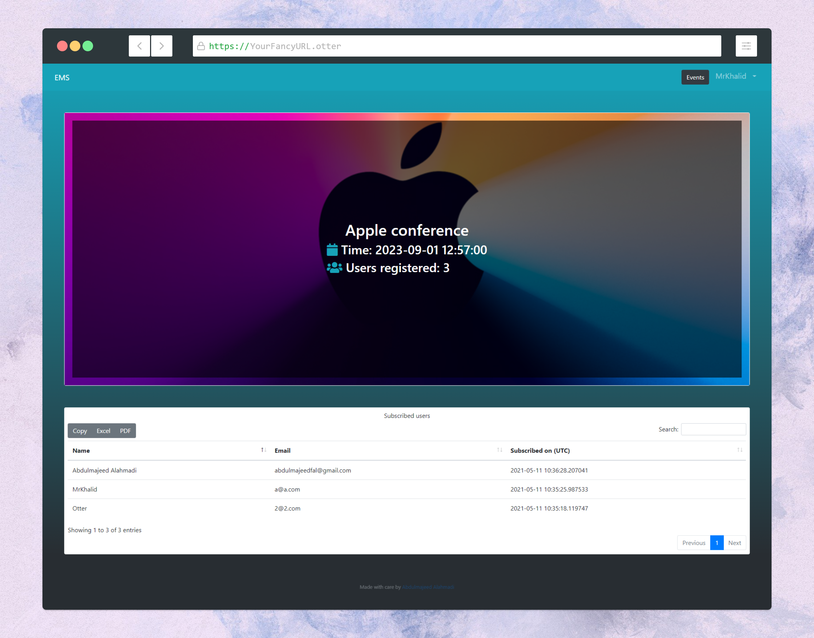

# About
My simple events management system built with Flask and some other libraries, as all of my other projects they are only made so that i have more practice with the tools so don't expect a lot of functionalities.

## What can you do with it?
### Register, Log in (Email and pass or via Google)

### Browse events

### Subscribe to events

### Create Events

### See more information about events
  

# What's next?
- make Mobile application and connect to Flask via API